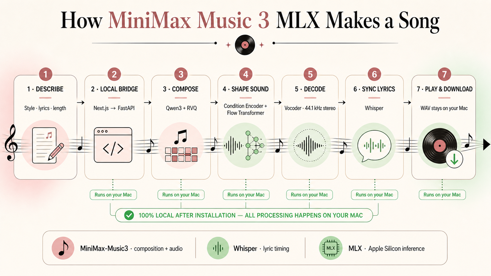

# MiniMax Music 3 MLX

Freedom To Download Your Song. An independent, open-source app for generating complete songs locally on an Apple Silicon Mac with MiniMax‑Music3 and MLX.

## Start

1. Download this repository.
2. Open Terminal and run these commands, replacing the example path with your downloaded folder:

   ```sh
   cd "/path/to/minimax-music3-mlx"
   ./setup-local.sh
   ```

3. Run:

   ```sh
   ./start-local.sh
   ```

Done. The app opens in your browser. On the first run, click **Download MiniMax‑Music3** once.

Later, you only need to run `./start-local.sh`. On a Mac, you can also double-click **Open MiniMax Music 3.command**.

## What you need

- Apple Silicon Mac and macOS 14 or newer
- 64 GB unified memory for supported use; 48 GB is experimental
- About 60 GB of free storage
- Node.js 20.9 or newer and Python 3.12

The current full-precision pipeline does not support 32–36 GB Macs. Five-minute songs are supported; generation may take tens of minutes.

## How it works



- **MiniMax‑Music3** supplies the tokenizer, customized Qwen3 language model, RVQ depth decoder, condition encoder, flow transformer, and vocoder. Together they turn your description and lyrics into a 44.1 kHz stereo song.
- **Whisper Large V3 Turbo** listens to the finished song locally and aligns each lyric line with the audio.
- **MLX** runs the complete inference pipeline in unified memory on Apple Silicon. After the one-time model download, generation, lyric syncing, playback, and storage stay on your Mac.

## This project and amma.live

This repository is a standalone local music-generation app and is separate from amma.live. The maintainer created [amma.live](https://amma.live) as an online music-generation app for anyone who would like to try it in a browser.

## Privacy and local files

The web app binds to `127.0.0.1:3000` and the private ML engine binds to `127.0.0.1:7860`. Each launch creates a new random engine token that is not exposed to browser JavaScript.

Songs are stored in `data/`. Models are stored in `model/`. Both folders are ignored by Git.

## Models

The app downloads these pinned model revisions:

- `MiniMaxAI/MiniMax-Music3` at `fbdf52fbaaca799592917417eb05f1899f1255ec`
- `mlx-community/whisper-large-v3-turbo` at `a4aaeec0636e6fef84abdcbe3544cb2bf7e9f6fb`

MiniMax‑Music3 is an open-weight model under the separate [MiniMax‑Music3 Community License](https://huggingface.co/MiniMaxAI/MiniMax-Music3/blob/main/LICENSE). The model weights are not included in this repository or covered by its MIT license. Review the model license before distributing a modified or commercial product.

This app and its MLX implementation are independent community work, not an official MiniMax or Apple product.

## Development checks

```sh
npm ci
npm run lint
npm test
.venv/bin/python -m unittest discover -s tests -p 'test_*.py'
npm audit
uv pip check --python .venv/bin/python
```

See [HOW_TO_USE.md](HOW_TO_USE.md) for usage help, [SECURITY.md](SECURITY.md) for the local threat model, [THIRD_PARTY_NOTICES.md](THIRD_PARTY_NOTICES.md) for attribution, and [CONTRIBUTING.md](CONTRIBUTING.md) before contributing.
